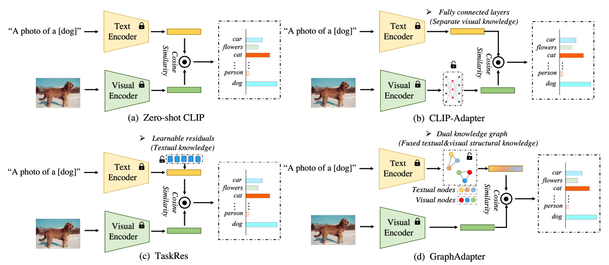

# GraphAdapter: Tuning Vision-Language Models With Dual Knowledge Graph
The efficient tuning method for VLMs

[Xin Li](http://home.ustc.edu.cn/~lixin666/), [Dongze Lian](), [Zhihe Lu](), [Jiawang Bai](), [Xinchao Wang](), and [Zhibo Chen](https://scholar.google.com/citations?user=1ayDJfsAAAAJ&hl=en)

University of Science and Technology of China (USTC), National University of Singapore (NUS)

## New!!!
| 2023-09-26  | The arxiv version has been released | 

  

